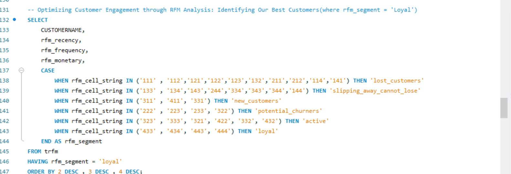
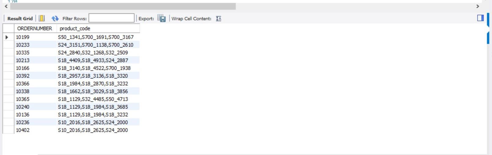

# RFM Sales Data Analysis

## Introduction
In the dynamic landscape of sales, the RFM (Recency, Frequency, Monetary) analysis provides a powerful lens for understanding customer behavior and tailoring marketing strategies. This documentation delves into an extensive RFM analysis of sales data, aiming to derive insights into customer segments, retention rates, and strategic opportunities.

## Problem Statement
The challenge lies in unraveling the intricacies of customer interactions with the sales data. Key business questions revolve around understanding the recency of purchases, the frequency of transactions, and the monetary value of customer engagements.

## About Data
The dataset utilized for this RFM analysis is a sample of sales data, encompassing details such as order dates, customer names, product details, and sales figures. This dataset spans multiple years, providing a rich source for uncovering patterns in customer behavior.

## Data Cleaning and Transformation Techniques
1. Data Inspection
The initial step involved inspecting the raw sales data using the query SELECT * FROM sales_data_sample;. This facilitated understanding the structure and attributes of the dataset.

2. Checking Unique Values
Distinct values for key columns such as status, YEAR_ID, PRODUCTLINE, COUNTRY, DEALSIZE, and TERRITORY were explored using SELECT DISTINCT queries. This ensured data integrity and a better grasp of the dataset.

3. Updating and Altering Date Values
To enhance temporal analysis accuracy, the date values were updated and the column was altered to DATETIME format. This involved using SQL queries to transform the date format and modify the column, as seen in the provided code.

## Analytics Insights
- What was the top 3 best month for sales in a specific year? How much was earned that month?

- November seems to be the month, what top 5 product do they sell the most November?

- Who is our best customer (this could be best answered with RFM)

- What product are most often sold together?

- Identify the top 3 product line with the highest average monthly sales growth and the corresponding month.

## Derived Insights through RFM Analysis

1. Customer Segmentation with RFM Analysis
   
In categorizing customers through the utilization of RFM analysis, nuanced insights into distinct customer segments are unveiled. This process encompasses the calculation of recency, frequency, and monetary value metrics for each customer, contributing to a comprehensive understanding of their behaviors and preferences.

2. Customer Retention Rate

Through the careful analysis of customer transactions spanning multiple quarters and the application of the RFM framework, this query is employed to calculate the customer retention rate. The derived measure serves as a tool to illuminate the effectiveness of implemented customer retention strategies.

## Conclusion
In conclusion, the RFM analysis proved to be a valuable tool for deciphering customer behavior within the sales dataset. It provided insights into customer segments, highlighted retention trends, and offered a foundation for strategic decision-making.

## Recommendations
- Tailor marketing strategies based on distinct customer segments identified through RFM analysis.
- Implement targeted campaigns to re-engage customers who exhibit a decline in recency, frequency, or monetary value.
- Explore personalized promotions for high-value customers to maximize their contribution to overall sales.
- Regularly reassess and update customer segments based on evolving sales trends.
- Consider leveraging RFM analysis in conjunction with other data sources for a holistic understanding of customer behavior.
